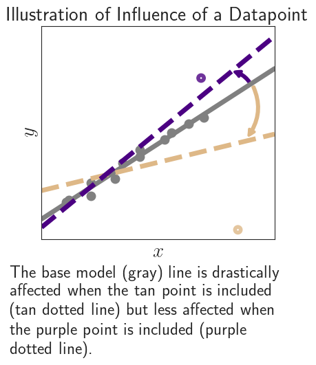

# Influence Theory 
This repository contains the code and the scripts to reproduce the experiments the paper
[Statistical and Computational Guarantees for Influence Diagnostics](https://arxiv.org/abs/2212.04014). 

**Influence functions** quantify the influence of a fixed data point $z$ on an etimator $\theta_n$. 
Given an estimator $$\theta_n := \arg \min_{\theta \in \Theta} \sum_{i=1}^n \ell (z_i, \theta),$$ where 
$\theta$ is the parameter of interest, and $\ell(z,\theta)$ is the loss over a dataset $z_1,...,z_n$. We quantify the influence of a fixed data point $z$ on the estimator $\theta_n$ using the perturbation
$$\theta_{n,\epsilon,z}:= \arg \min_{\theta \in \Theta} \{ \frac{1-\epsilon}{n} \sum_{i=1}^n \ell(z_i,\theta) + \epsilon \ell(z,\theta)\}$$
for some $\epsilon > 0$.

Using these definitions, we approximate the influence function as
$$I_n(z) := \frac{\theta_{n,\epsilon,z} - \theta_n}{\epsilon} \approx \frac{d\theta_{n,\epsilon,z}}{d\epsilon}\vert_{\epsilon = 0}$$

<p align="center">

</p>

In this paper we establish finish-sample statistical bounds under self-concordance, 
as well as computational complexity bounds for influence functions and 
approximate maximum influence perturbations using efficient inverse-Hessian-vector 
product implementations.

In this repo, we provide code which computes the influence function and most influential subsets for two transformer language model experiments. We also provide the code which computes the influence function for two linear models with both synthetic and economic data.

## Dependencies
The code is written in Python and the dependencies are:
- Python >= 3.7.13
- PyTorch >= 1.1
- Huggingface Transformers >= 4.24.0
- scikit-learn >= 1.0.2

**Conda Environment**:
We recommend using a [conda environment](https://docs.conda.io/en/latest/miniconda.html)
for Python 3.7.
To setup the environment, run
```bash
conda env create --file environment.yml
# activate the environment
conda activate influence_theory
```
**Install Dependencies via Pip**:
To install dependencies, run
```bash
pip install -r requirement.txt
```
## Datasets
We use four different datasets, we outline them below. 

### Non-Convex Experiments (Language Model Experiments)
All the data for the two non-convex (language model) experiments can be downloaded from this [Google Drive](https://drive.google.com/drive/u/2/folders/10O8SPuWVR-1YrHf0U8amYR90FGg7EayF). Place all data files (7 total) in the `data` folder in the main directory. Below are details of this data.

**1. Zero Shot Relations Extraction (zsRE)**

We used a subset of the zsRE data originally collected by [Levy et. al. 2017](http://nlp.cs.washington.edu/zeroshot/). The zsRE data consists of an input question $x_i$, and target answer $y_i$. 

**2. WikiText**

This is a subset of the WikiText103 by [Merity et. al. 2016](https://arxiv.org/abs/1609.07843). The WikiText data has a paragraph as the input $x_i$ and the next 10 token continuation as the output $y_i$.

### Convex Experiments

**3. Cash Transfer Experiment**

This data is provided free by OPEN ICPSR and the American Economic Association. However, in order to download the data you must fill out a Terms of Use. Please download the file "table1.dta" by following the instructions [here](https://www.openicpsr.org/openicpsr/project/113289/version/V1/view?path=/openicpsr/113289/fcr:versions/V1/table1.dta&type=file). 

Once downloaded, place the file under the folder `convex_exp/data/cash_transfer_data` 

Citation: Angelucci, Manuela, and De Giorgi, Giacomo. Indirect Effects of an Aid Program: How Do Cash Transfers Affect Ineligibles’ Consumption?. Nashville, TN: American Economic Association, 2009. Ann Arbor, MI:, 2019-10-12.

**4. Oregon Medicaid Experiment**

This data is provided free by the National Bureau of Economic Research. However, it also requires each user to acknowledge a Terms of Use. Please download the zip file "oregon_puf" by following the instructions [here](https://www.nber.org/research/data/oregon-health-insurance-experiment-data). Once downloaded extract the following data files from the downloaded zip file "oregon_puf.zip".
  1. "OHIE_Public_Use_Files"--> `OHIE_Data/oregonhie_descriptive_vars.dta`
  2. "OHIE_Public_Use_Files"--> `OHIE_Data/oregonhie_survey12m_vars.dta`

Place both data files under the folder `convex_exp/data/oregon_data` 

Citation: Oregon Health Insurance Experiment Web Page is available at [here](www.nber.org/oregon)

## Experimental Pipeline (Convex Experiments)
Experimental code for both of the simulations (linear and logistic regression) and both of the economic experiments (Oregon Medicaid and Cash Transfer) can be found in the `convex_exp` folder. Each experiment is outlined in a juypter notebook and can be run by using the "Run All" function. Below is the folder location for each experiment.
* Linear Regression: `convex exp/simulation/simulation_linear_exp.pdf` (run time: less than 1 minute)
* Logistic Regression: `convex exp/simulation/simulation_logistic_exp.pdf` (run time: approximately 20 minutes)
* Oregon Medicaid: `convex exp/economic_exp/oregon_medicaid.pdf` (run time: less than 5 minutes)
* Cash Transfer: `convex exp/economic_exp/cash_transfer.pdf` (run time: less than 1 minute)

## Experimental Pipeline (Non-Convex Experiments)
For each dataset (zsRE and WikiText), the experimental pipeline is as follows:
1. finetune the pretrained models on a range of subsets of the total data
2. compute the influence on a single test point using each of the four approximation method
3. compute the Most Influential Subset for five pre-selected test points using the Arnoldi method

The creation of the finetune models (Step 1) must be run first. Steps 2 & 3 can proceed in any order.

Here is how to find the scripts step-by-step for the zsRE experiement. Repeat the below steps for WikiText by replacing "zsre" with "wiki". 

**Step 1. Finetune the Models:**
Create the folder `models/zsre` in the base directory. Then, run `scripts/train_model_zsre` to generate six models of Bart-base finetuned on a subset of the original data. 

This script further finetunes a Bart-base (or distil GPT2 for WikiText) on a subset of training data n. All outputs will appear as `models/zsre/model_zsre_${data_seed}_${n}_${n_test}`.

This should take about 1.5 hours for the zsRE experiment and 7.5 hours for WikiText experiment. 

**Step 2. Approximated Influence of Single Point:**
Create the folder `results/zsre` in the base directory. Then, run `scripts/IF_exp_zsre` to generate the approximated influence of a training point for five different points using conjugate gradients, SGD, SVRG, and the Arnoldi method.

This script calculates the approximated influence of a specific training point on test set loss. We run this for 5 different training points over each of the four approximation methods outlined in the paper (conjugate gradients, SGD, SVRG, Arnoldi). All outputs will appear as `results/zsre/results_{config.task}_{config.n}_{config.approx_method}_{config.method.num_epochs}_{config.regularization_param}.pt"`.

This should take about 65 hours for the zsRE experiment and 140 hours for WikiText experiment. 

**Step 3. Approximated Most Influential Subset:**
Create the folder `results/zsre/MIS` in the base directory. Then, run `scripts/MIS_exp_zsre` to generate the approximated most influential subsets for five pre-selected test points, found using the Arnoldi method.

This script calculates the both the Most Influential Subset and the approximated influence of the Most Influencial Subset on the test set loss, at differing values of $\alpha$. We run this for 5 pre-selected test points and use the Arnoldi approximation. The Most Influential Subsets output to `results/zsre/results_MIS_{config.task}_{config.n}_{config.method.arnoldi.n_it}_{config.alpha}.pt"` and the approximated influence outputs to `results/zsre/results_MISinfluence_{config.task}_{config.n}_{config.method.num_epoch}_{config.alpha}.pt"`

This should take about 14 hours for the zsRE experiment. 

## Citation
If you find this repository useful, or you use it in your research, please cite:
```
 @article{fisher_liu_pillutla_choi_harchaoui_2022, 
 title={Statistical and Computational Guarantees for Influence Diagnostics}, 
 author={Fisher, Jillian and Liu, Lang and Pillutla, Krishna and Choi, Yejin and Harchaoui, Zaid}, 
 journal={arXiv preprint}
 url = {https://arxiv.org/abs/2212.04014},
 year={2022}, 
 month={Dec}
 } 
```
    
## Acknowledgements
This work was supported by NSF DMS-2023166, NSF CCF-2019844, NSF DMS-2052239, PIMS CRG (PIHOT), NSF DMS-2134012, CIFAR-LMB, and faculty research awards.
